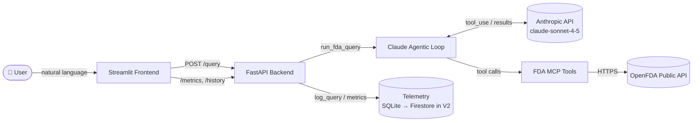

# 🏥 FDA Device Intelligence Platform

> Ask a natural-language question about FDA medical device safety and get a clinically-structured answer backed by **live** OpenFDA data. Claude acts as the intelligence layer — it autonomously decides which FDA tools to call, fetches real recall / adverse-event / classification data, and synthesizes the answer. Every query is logged with cost, latency, and token usage, and a Streamlit dashboard visualizes the telemetry.


---

## What problem does it solve?

Regulatory affairs teams, clinicians, and device-safety researchers routinely need to answer questions like *"What Class I recalls hit infusion pumps recently?"* — but the OpenFDA API speaks Lucene query syntax across several disjoint endpoints. This platform puts an **agentic AI layer** in front of that data: you ask in plain English, Claude picks the right tools, runs the queries, and returns a synthesized, cited answer — while logging exactly what each query cost.

---

## Architecture



**Flow:** User → Streamlit → FastAPI → Claude (agentic tool-use loop) → MCP FDA tools → OpenFDA. Each query's cost/latency/tokens are written to the telemetry store and surfaced on the Analytics dashboard.

---

## Tech Stack

| Layer        | Technology                                   |
|--------------|----------------------------------------------|
| AI Model     | Claude `claude-sonnet-4-5` (Anthropic API)   |
| Agentic Tools| MCP (FastMCP) wrapping OpenFDA endpoints     |
| Backend      | FastAPI + Uvicorn                            |
| Frontend     | Streamlit + Plotly                          |
| Telemetry    | SQLite (V1) → Google Firestore (V2)          |
| Data Source  | OpenFDA public REST API (no auth required)   |
| Testing      | pytest + pytest-cov (89% coverage)           |
| Config       | python-dotenv + a central `Settings` object  |

---

## Project Structure

```
src/
├── config.py            # Central env-driven settings (singleton)
├── logging_config.py    # get_logger() — one place for log setup
├── mcp_server/
│   └── fda_tools.py      # 3 OpenFDA functions + MCP tool wrappers
├── backend/
│   ├── claude_client.py  # Bounded agentic loop, cost/latency accounting
│   ├── telemetry.py      # SQLite logging (swap boundary for Firestore)
│   └── main.py           # FastAPI app: /health /query /metrics /history
└── frontend/
    └── app.py            # Streamlit: Query tab + Analytics tab
tests/                    # pytest suite (offline, fully mocked)
```

---

## Setup & Run Locally

### 1. Clone and create a virtual environment
```bash
git clone <your-repo-url>
cd FDA-Device-Intelligence
python3 -m venv venv
source venv/bin/activate          # Windows: venv\Scripts\activate
```

### 2. Install dependencies
```bash
pip install -r requirements.txt           # runtime
pip install -r requirements-dev.txt       # + test tooling (optional)
```

### 3. Configure your API key
```bash
cp .env.example .env
# edit .env and set ANTHROPIC_API_KEY=sk-ant-...
```

### 4. Start the backend
```bash
uvicorn src.backend.main:app --reload --port 8000
```
API is live at `http://localhost:8000` — interactive docs at **`/docs`**.

### 5. Start the frontend (new terminal)
```bash
source venv/bin/activate
streamlit run src/frontend/app.py
```
Dashboard opens at `http://localhost:8501`.

### 6. Run the tests
```bash
pytest                # 37 tests, ~89% coverage, runs fully offline
```

---

## API Documentation

| Method | Path       | Body                  | Description                                   |
|--------|------------|-----------------------|-----------------------------------------------|
| GET    | `/health`  | —                     | Liveness probe → `{"status": "ok"}`           |
| POST   | `/query`   | `{"query": "string"}` | Run the agentic FDA query; returns answer + telemetry |
| GET    | `/metrics` | —                     | Aggregate stats (count, cost, avg latency, avg tokens) |
| GET    | `/history` | —                     | Full query log, newest first                  |

**`POST /query` validation:** query length must be **3–500** characters. Anthropic failures (auth, billing, rate limit) return **HTTP 502** with a readable message rather than a bare 500.

### Example request
```bash
curl -X POST http://localhost:8000/query \
  -H "Content-Type: application/json" \
  -d '{"query": "What are recent Class I recalls for infusion pumps?"}'
```

### Example response
```json
{
  "answer": "I found 3 recent Class I recalls for infusion pumps...",
  "tools_called": ["search_device_recalls"],
  "input_tokens": 1240,
  "output_tokens": 380,
  "cost_usd": 0.00942,
  "latency_ms": 4120.5
}
```

---

## Example Queries

1. **What are recent Class I recalls for infusion pumps?**
2. **Show me adverse events for the da Vinci surgical robot**
3. **How is a pacemaker classified by the FDA?**
4. **What recalls have been issued for glucose monitors in the past year?**
5. **Are there any adverse events linked to metal-on-metal hip implants?**

---

## Configuration

All settings are environment-driven (see `.env.example`). Key knobs:

| Variable               | Default              | Purpose                                   |
|------------------------|----------------------|-------------------------------------------|
| `ANTHROPIC_API_KEY`    | — (required)         | Anthropic API key                         |
| `CLAUDE_MODEL`         | `claude-sonnet-4-5`  | Model id                                  |
| `MAX_AGENT_ITERATIONS` | `10`                 | Cost guard rail — max tool-use rounds     |
| `OPENFDA_TIMEOUT`      | `10`                 | Per-request OpenFDA timeout (seconds)     |
| `TELEMETRY_BACKEND`    | `sqlite`             | Telemetry store: `sqlite` or `firestore`  |
| `FIRESTORE_COLLECTION` | `queries`            | Firestore collection (firestore backend)  |
| `FDA_API_URL`          | `http://localhost:8000` | Backend URL the frontend calls         |
| `LOG_LEVEL`            | `INFO`               | Logging verbosity                         |

---

## Deploy to GCP Cloud Run (V2)

The backend ships as a container and runs on Cloud Run with **Firestore**
telemetry and the Anthropic key sourced from **Secret Manager**. Telemetry is
pluggable: `TELEMETRY_BACKEND=sqlite` locally, `firestore` in the cloud — the
`telemetry.py` / `telemetry_firestore.py` modules share one public API.

### One-time setup
```bash
# Set your project and enable the required APIs
gcloud config set project YOUR_PROJECT_ID
gcloud services enable run.googleapis.com cloudbuild.googleapis.com \
    firestore.googleapis.com secretmanager.googleapis.com

# Create the Firestore database (Native mode)
gcloud firestore databases create --location=us-central1

# Store the Anthropic API key as a secret
echo -n "sk-ant-..." | gcloud secrets create anthropic-api-key --data-file=-

# Let the Cloud Run runtime service account read the secret + use Firestore
PROJECT_NUMBER=$(gcloud projects describe YOUR_PROJECT_ID --format='value(projectNumber)')
SA="${PROJECT_NUMBER}-compute@developer.gserviceaccount.com"
gcloud secrets add-iam-policy-binding anthropic-api-key \
    --member="serviceAccount:${SA}" --role="roles/secretmanager.secretAccessor"
gcloud projects add-iam-policy-binding YOUR_PROJECT_ID \
    --member="serviceAccount:${SA}" --role="roles/datastore.user"
```

### Deploy (one command, via Cloud Build)
```bash
gcloud builds submit --config cloudbuild.yaml
```
This builds the image, pushes it, and deploys the `fda-device-intelligence`
service with `TELEMETRY_BACKEND=firestore` and the key wired from Secret Manager.

### Or build & deploy manually
```bash
gcloud builds submit --tag gcr.io/YOUR_PROJECT_ID/fda-device-intelligence
gcloud run deploy fda-device-intelligence \
    --image gcr.io/YOUR_PROJECT_ID/fda-device-intelligence \
    --region us-central1 --platform managed --allow-unauthenticated \
    --set-env-vars TELEMETRY_BACKEND=firestore \
    --set-secrets ANTHROPIC_API_KEY=anthropic-api-key:latest
```

### Point the frontend at the deployed API
```bash
export FDA_API_URL=https://fda-device-intelligence-xxxxx-uc.a.run.app
streamlit run src/frontend/app.py
```

> **Note:** Cloud Run authenticates to Firestore and Secret Manager via the
> service account's Application Default Credentials — no key file is baked into
> the image. The container listens on `$PORT` (8080), as Cloud Run requires.

---

## Known Limitations

- **OpenFDA data is not real-time.** OpenFDA refreshes periodically and historical coverage varies by endpoint; "recent" reflects the latest published data, not live filings.
- **Telemetry backend is pluggable.** SQLite (default) is single-node and local; Firestore (`TELEMETRY_BACKEND=firestore`) is used on Cloud Run. The Firestore `get_metrics` aggregates in Python by streaming documents — fine at telemetry scale, but large collections would want scheduled rollups.
- **No authentication or rate limiting yet.** CORS is open (`*`) and there is no per-user throttling; the `MAX_AGENT_ITERATIONS` cap is the only cost guard. Auth + rate limiting are planned.
- **Cost figures are estimates** computed from token counts and configured pricing, not billed amounts.
- **Synchronous request path.** A query blocks until Claude finishes its tool-use loop; there is no streaming or async fan-out yet.

---

## Roadmap

- **V1 — Local platform:** bounded agentic loop, SQLite telemetry, Streamlit dashboard, full test coverage. ✅
- **V2 (current) — Cloud:** Dockerfile + Cloud Build + Cloud Run, pluggable Firestore telemetry, `ANTHROPIC_API_KEY` via Secret Manager. ✅
- **V3 — More tools:** 510(k) submissions, PMA approvals, enforcement actions, registration & listing.
- **V4 — Analytics:** device-category trends, recall-severity breakdowns, cost projection, CSV export, comparative query mode.
- **V5 — Governance:** rate limiting, off-topic filtering, response disclaimers, `GOVERNANCE.md`.

See `CHANGELOG.md` for the detailed history.
